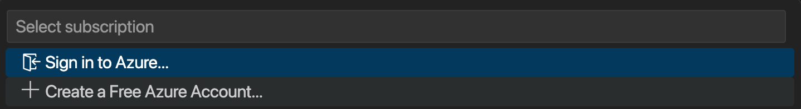
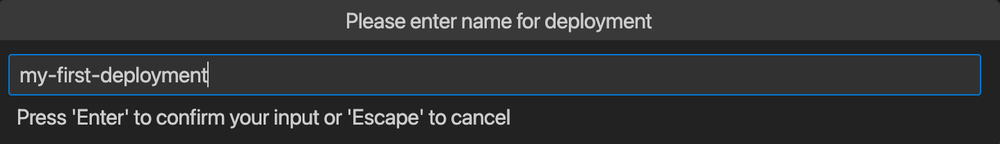
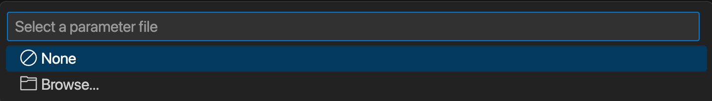
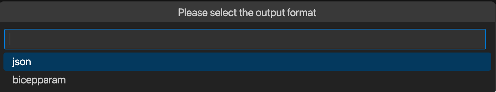

# Lab 2: Deploy a storage account using Bicep

In this lab you will author your first Bicep template and deploy a Storage Account to Azure.

## Lab overview

Below are the steps performed during this lab.

### Mandatory
- Create a `.bicep` file
- Declare a Storage Account resource in the template
- Deploy the template

### Optional (If you have time over)
- Add parameters to the template
- Generate a parameter file
- Re-deploy the template using a parameter file

### Documentation

You can find documentation to help you with this lab here:

- [Bicep syntax](https://learn.microsoft.com/azure/azure-resource-manager/bicep/file)
- [Deploy Bicep Files from Visual Studio Code](https://learn.microsoft.com/azure/azure-resource-manager/bicep/deploy-vscode)

## Lab steps (Mandatory)

Follow the steps below to author a template and deploy a Storage Account to Azure.

1. Open Visual Studio Code and open a folder on your local hard drive
2. Create a new file named `storage.bicep`
3. Using the knowledge gained during the presentation and demos write the code to deploy a storage account. Use hard-coded values for all properties.

> **Note:** If it's hard to author a template from scratch it's ok to export an existing template as a starter or use a built-in snippet.

4. When you are finished with the template, save it.
5. Right-click the `storage.bicep` file and select `Deploy bicep file...`.
6. Click `Sign-in to Azure` which will open up a browser Window.

7. Sign-in with an account that has access to an Azure Subscription.
8. Type in `my-first-deployment` as the name of the deployment.

9. Select the Azure Subscription where you want to deploy the storage account.
10. Select the Resource Group where you want to deploy the storage account.
11. When prompted for a parameter file select `None`.

12. Your deployment is now created in Azure.
13. Head over to the Azure Portal and verify that your Storage Account is successfully created.

## Lab steps (Optional)

Now it's time to make your template re-usable by adding parameters to it and create your first parameter file.

1. Change some of the hard-coded values for `name` and `location` property to parameters.
2. Add an output to the template that outputs the resource ID of the deployed storage
3. Right-click on the `storage.bicep` file and select `Generate Parameters File`.
4. Select `bicepparam` as the parameter file format.

5. Select `All Parameters` when prompted for which parameters to include.

6. Open the `storage.bicepparams` file, add values to your parameters.
7. Deploy the template again but this time using your `storage.bicepparams` file.